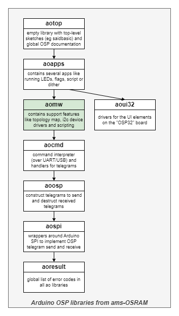
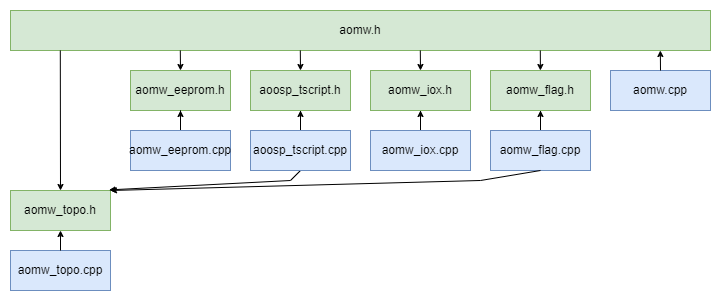

# OSP Middleware aomw

Library "OSP Middleware aomw", usually abbreviated to "aomw",
is one of the **aolibs**; short for Arduino OSP libraries from ams-OSRAM.
This suite implements support for chips that use the Open System Protocol, 
like the AS1163 ("SAID") or the OSIRE E3731i ("RGBi").
The landing page for the _aolibs_ is on 
[GitHub](https://github.com/ams-OSRAM/OSP_aotop).


## Introduction

Library _aomw_ is a library with middleware for OSP applications.
It implements features like building a topology map of an OSP chain 
(which kind of chip at which address), has I2C device drivers 
(for I2C devices typically connected to a SAID bride) and scripting 
(simple light animations).



These features are typically used in the `aoapps` library.


## Examples

This library comes with the following examples.
You can find them in the Arduino IDE via 
File > Examples > OSP Middleware aomw > ...

-  **aomw_min** ([source](examples/aomw_min))  
   This demo scans the OSP chain using the topo builder from the middleware to 
   form a topology map of all nodes of the OSP chain. Next, it toggles
   the first triplet between magenta and yellow. Note that topo abstracts
   away that a SAID has three RGB triplets and an RGBI one, and that they
   need different telegrams for the same results.

-  **aomw_topodump** ([source](examples/aomw_topodump))  
   This demo scans the OSP chain using the topo builder from the middleware to 
   form a topology map of all nodes of the OSP chain. Next, it prints out the 
   chain configuration: nodes, triplets, i2cbridges.
   It does feature some time measurement code. See the comment at
   the end of the sketch for an analysis of the measurements.

-  **aomw_topodemo** ([source](examples/aomw_topodemo))  
   This demo first creates a topology map of all nodes of the OSP chain. 
   Next it animates a running led animation, constantly updating the triplets.
   The topo map creation and running led animation is driven from a state
   machine. This would allow running commands from serial or scanning for 
   presses of UI buttons.

-  **aomw_flag** ([source](examples/aomw_flag))  
   This demo builds a topology map of all nodes of the OSP chain. Next, it 
   uses this topo map to paint country flags spread out over an entire OSP chain.

-  **aomw_iox** ([source](examples/aomw_iox))  
   This demo initializes an OSP chain, powers the I2C bridge in a SAID and 
   checks whether there is an I/O expander (IOX). An I/O expander is an 
   I2C device that exposes a set of GPIO pins. If there is an IOX, the demo 
   plays a light show on the connected signaling LEDs, which can be 
   interrupted by pressing a button connected to the IOX.

-  **aomw_eeprom** ([source](examples/aomw_eeprom))  
   This demo initializes an OSP chain, powers the I2C bridge in a SAID
   and checks whether there is an EEPROM. If so, reads and prints the
   entire EEPROM contents, then modifies one row and then restores that.
   It finalizes by doing a compare of the current EEPROM content with
   the values read at the start.

-  **aomw_tscript** ([source](examples/aomw_tscript))  
   This demo uses topo to initialize the OSP chain, then installs one of the
   animation scripts. The main program continuously loops over all script
   instructions to draw the frames.


## Module architecture

This library contains several modules, see figure below (arrows indicate `#include`).



- **aomw_topo** (`aomw_topo.cpp` and `aomw_topo.h`) builds and then 
  provides the so-called "topology map", a data structure describing the 
  attached OSP chain: how many OSP nodes, how many RGB triplets, how many 
  I2C bridges, plus to which OSP node each triplet or I2C bridge connects. 
  Building the map includes reset, init and a scan (identity, otp) of all 
  nodes, plus configuring (drive current, power state, errors) all nodes.
  
  Another high level feature of the topo module is to abstract away how to 
  _drive_ triplets (is a triplet on a channel, the channel's drive current 
  settings, the available pwm bits). The topo module defines its own
  dynamic range: "topo brightness range", ranging from 0 to 0x7FFF and 
  is able to map that any triplet (RGBI's and RGBs connected to SAID).
  The `aomw_topo_settriplet` abstractions makes it _the API_ 
  for other modules (tscript, flag, most apps in library aoapps).
  
  The topo module also has a command handler that can be registered with the 
  command interpreter. This makes the topology map and the high level
  `aomw_topo_settriplet()` available through the serial interface.
  
- **aomw_eeprom** (`aomw_eeprom.cpp` and `aomw_eeprom.h`) is a driver for
  I2C based EEPROMs (AT24C02C with 256 locations of 1 byte). The driver 
  can read bytes from or write bytes to such an EEPROM. It also has a 
  compare feature and a presence check (test if an EEPROM is attached 
  to the I2C bus of a SAID).

- **aomw_tscript** (`aomw_tscript.cpp` and `aomw_tscript.h`) implements an
  interpreter that executes instructions describing an animation on an RGB 
  strip. Typically those scripts are stored in an EEPROM, but the scripts can 
  also come from other sources, there is no dependency from `aomw_tscript` to 
  `aomw_eeprom`. This module uses `aomw_topo` to render the script so any
  OSP chain supported by topo could be used as a target.
  
  The script is an balance between functionality and low memory footprint.
  Instructions are 16 bits (so a 256 byte EEPROM can store 128 instructions).
  The RGB values in the instruction are only 3 bit each (so 8 shades). A more
  detailed explanation is in [aomw_tscript.cpp](examples/aomw_tscript.cpp).
  
  This module also contains some animation scripts. The application 
  [eepromflasher](https://github.com/ams-OSRAM/OSP_aotop/tree/main/examples/eepromflasher)
  allows writing scripts to EEPROMs. The app 
  [aoapps_aniscript](https://github.com/ams-OSRAM/OSP_aoapps/tree/main/src/aoapps_aniscript)
  reads those EEPROMs and play the animation.

- **aomw_iox** (`aomw_iox.cpp` and `aomw_iox.h`) is a driver for I2C based 
  I/O expander (PCA6408ABSHP). An I/O expander is an I2C device that exposes
  a set of GPIO pins. This driver is specificly written to control the 
  I/O expander on the SAIDbasic board: 4 of its GPIOs are attached to a 
  signaling LED, and 4 of its GPIOs are attached to a button.

  The app [aoapps_swflag](https://github.com/ams-OSRAM/OSP_aoapps/tree/main/src/aoapps_swflag)
  uses the I/O expander to select one in four flags.
  
- **aomw_flag** (`aomw_flag.cpp` and `aomw_flag.h`) is a module that can map
  one of its supported country flags (Dutch, European union) to the OSP chain. 
  The flags are available by name and by index.

  This module uses `aomw_topo` to render the flags.
  The app [aoapps_swflag](https://github.com/ams-OSRAM/OSP_aoapps/tree/main/src/aoapps_swflag)
  uses this module render a flag.

   
Each module has its own header file, but the library has an overarching 
header `aomw.h`, which includes the module headers. It is suggested that 
users just include the overarching header.


## API

The header [aomw.h](src/aomw.h) contains the API of this library.
It includes the module headers [aomw_topo.h](src/aomw_topo.h), 
[aomw_eeprom.h](src/aomw_eeprom.h), [aomw_tscript.h](src/aomw_tscript.h), 
[aomw_iox.h](src/aomw_iox.h) and [aomw_flag.h](src/aomw_flag.h).
The headers contain little documentation; for that see the module source files. 

### aomw

- `aomw_init()` not really needed, but added for forward compatibility.
- `AOMW_VERSION`  identifies the version of the library.

### aomw_topo

The API of the topo module can be divided in several parts.
First of all there are the functions to build the topology map.

- `aomw_topo_build()` is the high level function sending multiple telegrams
  to probe the OSP chain and build the topology map. this includes 
  reset and init.
- `aomw_topo_build_start()`, `aomw_topo_build_step()`, and `aomw_topo_build_done()`
  achieve the same as `aomw_topo_build()`, but these only send
  one telegram per call (see below on execution architecture).
  
Secondly, there are functions to query the topology map.

- `aomw_topo_loop()` indicates direction loop or bidir.
- `aomw_topo_numnodes()` returns the number of OSP node, and
  `aomw_topo_node_id(addr)` returns the type of each node.
  `aomw_topo_node_numtriplets(addr)` returns the number of triplets 
  associated with a node, and `aomw_topo_node_triplet1(addr)` the index
  of the first triplet associated to it.
- More important are the triplet functions: `aomw_topo_numtriplets()`
  returns the number of triplets, `aomw_topo_triplet_addr(tix)` returns
  the address of the OSP node driving the triplet, `aomw_topo_triplet_chan(tix)`
  returns the channel number withing the OSP node driving the triplet, and
  `aomw_topo_triplet_onchan(tix)` returns true if the OSP node uses channels.
- Two functions list all I2C bridges:
  `aomw_topo_numi2cbridges()` list the total amount, and 
  `aomw_topo_i2cbridge_addr(bix)` the associated OSP node.
- `aomw_topo_i2cfind(daddr7)` searches all I2C bridges for an I2C device that
  acknowledges a read from I2C device address `daddr7`.

Thirdly, there are functions to print (dump) the topology map.

- `aomw_topo_dump_summary()` prints a one-line summary to `Serial`.
- `aomw_topo_dump_nodes()` prints a table of all OSP nodes to `Serial`.
- `aomw_topo_dump_triplets()` prints a table all triplets to `Serial`.
- `aomw_topo_dump_i2cbridges()` prints a table of all I2C bridges to `Serial`.

Fourthly, there is the high level API to use the topology map to 
control (the color/brightness of) triplets.

- `AOMW_TOPO_BRIGHTNESS_MAX` defines the "topo brightness range" 
  maximum value (0 is the minimum).
- Type `aomw_topo_rgb_t` is a struct with three fields (r/g/b) each supposed 
  to be in the "topo brightness range".
- `aomw_topo_red`..`aomw_topo_white` some stock colors 
  (of type `aomw_topo_rgb_t`).
- Key function `aomw_topo_settriplet(tix,rgb)` sets a triplet `tix` 
  to a color `rgb`. As an extra feature, `rgb` is dimmed down using 
  the global dim level (see `aomw_topo_dim_set`).
- `aomw_topo_dim_set(dim)` and `aomw_topo_dim_get()` allow the caller to set
  a multiplication factor (0..dim/1024) for `settriplet`.

Fifthly, there is a command handler.

- `aomw_topo_cmd_register()` registers the `topo` command with the command 
  interpreter. This makes the topology map and the high level
  `aomw_topo_settriplet()` and `aomw_topo_dim_set()` available through 
  the serial interface.


### aomw_eeprom

The EEPROMS used in the OSP evaluation kit are I2C devices storing 1 byte
in 256 locations (AT24C02C). Depending on their position in the system, 
these I2C EEPROMs have a different I2C address.

For the boards in the eval kit, the I2C addresses of the used EEPROMs are 
already defined:

- `AOMW_EEPROM_DADDR7_OSP32` address of the EEPROM on OSP32 board.
- `AOMW_EEPROM_DADDR7_SAIDBASIC` address of the EEPROM on SAIDbasic board.
- `AOMW_EEPROM_DADDR7_STICK` address of the EEPROM on I2C EEPROM stick.

The access functions have the I2C address as parameter 
(next to the OSP address and the EEPROM memory address):

- `aomw_eeprom_read(...)`    reads bytes from an I2C EEPROM.
- `aomw_eeprom_write(...)`   writes bytes to an I2C EEPROM.
- `aomw_eeprom_compare(...)` reads bytes from an I2C EEPROM and compares them with a buffer.
- `aomw_eeprom_present(...)` checks if an EEPROM is present on an I2C bus.


### aomw_tscript

The tiny animation script interpreter has two high level functions.

- `aomw_tscript_install(*ints,num)` installs a script 
  (i.e. an array of 16 bit instructions) for the interpreter.
- `aomw_tscript_playframe()` plays one frame from the installed script.
  Should be called repeatedly with a constant rate to play the whole
  script with a fixed frame rate. Automatically wraps around.

Lower level functions

- `aomw_tscript_gotofirst()`, `aomw_tscript_gotonext()`, and 
  `aomw_tscript_atend()` form the iterator used by `playframe()`.
- `aomw_tscript_get()` returns the decoded instruction under the 
  cursor (pointer) of the iterator.
- `aomw_tscript_playinst()` plays one instruction (the one under the 
  cursor/pointer of the iterator). Note that one frame could be built-up 
  from multiple instructions via the "with-previous" flag.

Finally this module has some stock scripts.

- `aomw_tscript_rainbow()`, `aomw_tscript_rainbow_bytes()`
- `aomw_tscript_bouncingblock()`, `aomw_tscript_bouncingblock_bytes()`
- `aomw_tscript_colormix()`, `aomw_tscript_colormix_bytes()`
- `aomw_tscript_heartbeat()`, `aomw_tscript_heartbeat_bytes()`


### aomw_iox

Implements a driver for an I2C based I/O expander, specificaly for 
SAIDbasic board: 4 of its GPIOs are attached to a signaling LED, and
4 of its GPIOs are attached to a button.

First, the driver needs to be coupled to one I/O expander

- `aomw_iox_present(addr)` checks if the I/O expander is on the bus
  of the OSP node (SAID with I2C bridge).
- `aomw_iox_init(addr)` couples the I/O expander to the driver.
  This driver is not multi-instance. It can only control an IOX with I2C
  address AOMW_IOX_DADDR7 (0x20), and only one I2C bus - that is one SAID.

For the signaling LEDs on the I/O expander:

- `aomw_iox_led_on(leds)`, `aomw_iox_led_off(leds)`, and `aomw_iox_led_set(leds)`
  control the signaling LEDs connected to the I/O expander.
- `AOMW_IOX_LEDxxx` are the various masks denoting 1 (or zero, or all) 
  signaling LEDs.

For buttons on the I/O expander:

- `aomw_iox_but_scan(buts)` scans all input lines of the I/O expander 
  (those were the buttons are attached to) and stores the actual 
  four button states.
- `aomw_iox_but_wentdown(buts)`, `aomw_iox_but_isdown(buts)`, 
  `aomw_iox_but_wentup(buts)`, and `aomw_iox_but_isup(buts)` 
  check the current state.


### aomw_flag

The flag module has "painters": functions that paint a pattern on 
the OSP chain, using the `aomw_topo_settriplet()`.

- `aomw_flag_dutch_painter()`
- `aomw_flag_columbia_painter()`
- `aomw_flag_japan_painter()`
- `aomw_flag_mali_painter()`
- `aomw_flag_italy_painter()`
- `aomw_flag_europe_painter()`
- `aomw_flag_usa_painter()`
- `aomw_flag_china_painter()`

Next to that, the painters are also available by index:

- `AOMW_FLAG_PIX_DUTCH`
- `AOMW_FLAG_PIX_COLUMBIA`
- `AOMW_FLAG_PIX_JAPAN` 
- `AOMW_FLAG_PIX_MALI`    
- `AOMW_FLAG_PIX_ITALY`
- `AOMW_FLAG_PIX_EUROPE`
- `AOMW_FLAG_PIX_USA`   
- `AOMW_FLAG_PIX_CHINA`

The index can be used for this (lookup) table.

- `aomw_flag_count()`, `aomw_flag_name(pix)`, and `aomw_flag_painter(pix)`


## Execution architecture

One aspect in this library deserves touches the topic of execution 
architecture. The topo build (`aomw_topo_build()`) sends multiple telegrams
to probe the OSP chain and build the topology map.

This function has been split in three (`aomw_topo_build_start()`, 
`aomw_topo_build_step()`, and `aomw_topo_build_done()`). These send
one telegram per call. This is more suitable when other time critical
tasks need to be executed as well (e.g. button pulling, or polling serial
for incoming commands).


## Commands

The topo module also has a command handler that can be registered with the 
command interpreter. This makes the topology map and the high level
`aomw_topo_settriplet()` available through the serial interface.

```cpp
// Pick commands that we want in this application
void cmds_register() {
  aocmd_register();           // include all standard apps from aocmd
  aomw_topo_cmd_register();   // include the topo command
  Serial.printf("cmds: registered\n");
}

void setup() {
  // Identify over Serial
  Serial.begin(115200);

  // Initialize all libraries
  aospi_init(); 
  aoosp_init();
  aocmd_init();
  aoui32_init();
  aomw_init();

  cmds_register();
  ...
}

void loop() {
  // Process incoming characters (commands)
  aocmd_cint_pollserial();
  ...
}
```

Note that the command `topo enum` is more powerful than `osp enum`;
it is "query-able".


## Version history _aomw_

- **2024 October 8, 0.4.1**
  - Fixed parsing problems Doxygen.
  - Prefixed `modules.drawio.png` with library short name.
  - Updated topology and tiny script documentation (in cpp files).
  - Fixed doc on "under voltage".
  - Moved domain from `github.com/ams-OSRAM-Group` to `github.com/ams-OSRAM`.
  - Term cleanup ("indicator LEDs" and "I/O-expander").
  - Fixed bug in `walk` animation in `aomw_tscript.ino`.
  - Fixed HARDWARE description in `aomw_iox.ino`.
  - Fixed ADDR bug and added printf with used device address in `aomw_eeprom.ino`.
  - `aomw_flag.ino` now also shows how to use iterator.
  - Update to `readme.md`.
  - Added BEHAVIOR section to explanation in examples.

- **2024 September 5, 0.4.0**
  - API section in readme now shows parameter names.
  - Adapted to `aoosp_exec_resetinit` not needing `last` and `loop`.
  - Introduced "topo brightness range".
  - Warning to run `topo build` first.
  - More uniform error messages in command `topo`.
  - Added color `aomw_topo_off`.
  - Moved from shorthand `bix` to `iix` for "I2C bridge index".
  - Added links in `readme.md` for all example sketches.
  - added `name` to `aomw_topo_rgb_t`.
  - Example `aomw_min` added.
  - Corrected link to GitHub from aotop to OSP_aotop.
  - Remove "oalib" from `sentence=` in `library.properties`.
  - Arduino name changed from `OSP Middleware - aomw` to `OSP Middleware aomw`.
  - Renamed dir `extra` to `extras`.
  - `license.txt`, `examples\xxx.ino` line endings changed from LF to CR+LF.

- **2024 July 02, 0.3.0**  
  - Initial release candidate.


(end)
